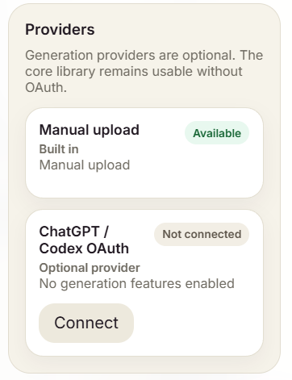
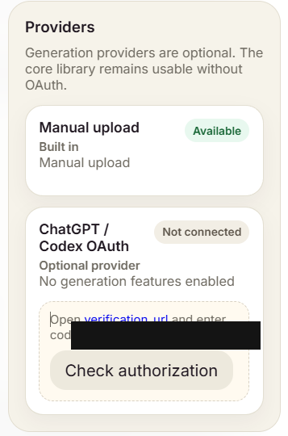
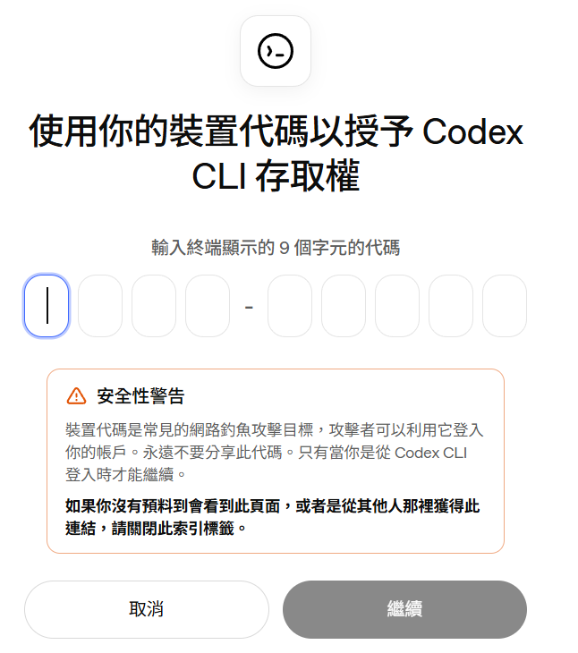
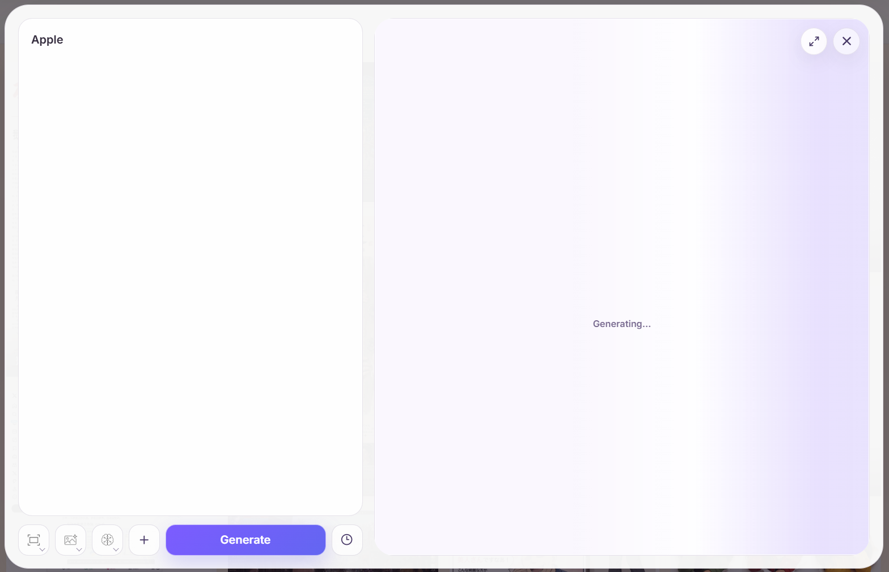
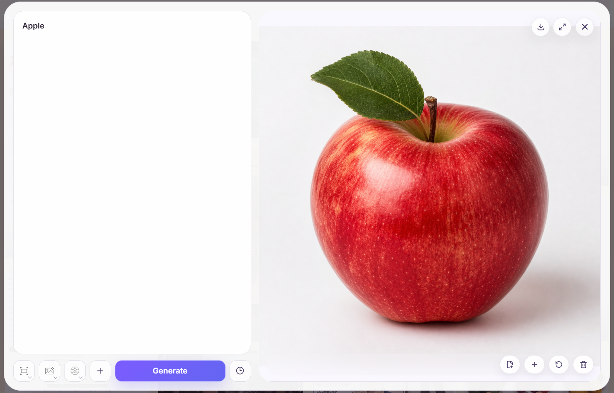
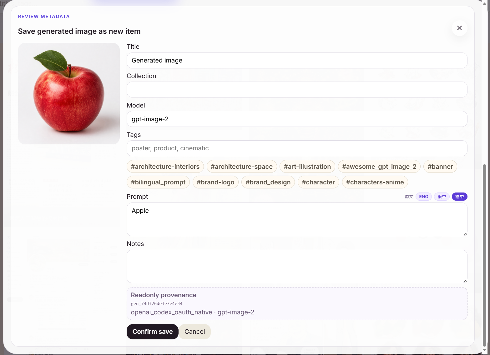

# Local Generation Guide

Local installs can optionally connect **ChatGPT / Codex OAuth** for image generation. The GitHub Pages Online Read Only Demo stays read-only and does not expose generation or mutation controls.

## What the local generation flow does

Once connected, you can:

- Generate a new image from a fresh prompt.
- Generate a variant from an existing reference.
- Review generated results before saving them into the library.
- Attach a result to the current item.
- Save a result as a new item with editable metadata.
- Keep generated-output provenance such as provider, model, source item, generation job, and timestamps.
- Use prompt variables such as `{{subject}}`, `{{style}}`, or `{{主體}}` in reusable template prompts and fill them before each generation.

No OpenAI API key is required by the app for the ChatGPT / Codex OAuth path. Advanced provider configuration is available for users who need it, but the normal flow is handled from the Config drawer.

## Privacy boundary

Generation is local-install only. The public GitHub Pages demo does not perform live imports or generation and does not expose Add/Edit/private-library controls.

The app-owned auth store lives outside the prompt library by default. Tokens must never be committed to git, sample bundles, backups, or GitHub Pages exports.

## Connect the provider

Open **Config → Providers**. Manual upload is always available; the ChatGPT / Codex OAuth provider is optional.

  

Choose **Connect**. The app opens a device-login step: follow the verification link, enter the displayed user code, and then return to BODR Image Prompt to check authorization.

  

The browser approval page may say **Codex CLI** because the current beta provider uses the Codex OAuth device flow behind the scenes. Only approve it if you started the flow yourself from your local BODR Image Prompt app.

  

After approval, the provider card should show **Connected** and list the available generation modes. Account details should be treated as private; the screenshot below is redacted.

  

## Generate and review results

Open the local generation composer, type a prompt, choose the desired controls, and run **Generate**. Use double braces for reusable fields, for example `A portrait of {{subject}} in {{style}}`; the composer shows fields for each variable and previews the resolved prompt before sending.

  

When the result appears, you can inspect the generated image, download it, attach it to the current item, create another variant, or delete the result.

  

If you save a result as a new library item, review and edit the metadata first. The saved item keeps readonly provenance for the generation job, provider, and model.

  

## Current provider notes

The current beta line includes an experimental `openai_codex_oauth_native` provider path labelled in the UI as **ChatGPT / Codex OAuth**.

Current hardening follow-ups include:

- Cross-process token refresh locking.
- Fresh OAuth onboarding QA.
- Clearer error mapping for auth expiry, Cloudflare/challenge, empty image results, and upstream API drift.
- Text+Reference to Image and Image Edit payload support using `reference_image_ids`.
- Retry controls and richer job state transitions.
- More complete local-only Generation UX polish.

## Benchmark note

While building BODR Image Prompt's Image 2.0 generation workflow, the project also benchmarked which Codex/ChatGPT backend tool-calling model and quality setting worked best for this app. The test covered GPT-5.5, GPT-5.4, and GPT-5.3-Codex across Low, Medium, and High quality.

The practical beta default is **GPT-5.4 + High**: acceptable speed with the strongest visual quality in those tests. Users can still change both the tool-calling model and quality setting manually.

See the benchmark notes and images in [`generation-matrix-chatgpt-codex-impasto-florals-2026-05-01.md`](generation-matrix-chatgpt-codex-impasto-florals-2026-05-01.md).
